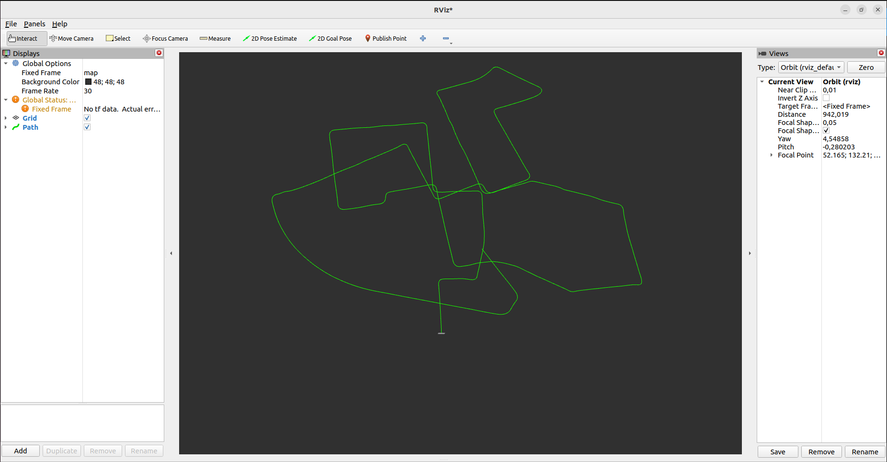

# 📌 **README.md — Stereo Visual Odometry (ROS2 Humble)**

```markdown
# Stereo Visual Odometry (ROS2 Humble)

This repository contains a simple **Stereo Visual Odometry (VO)** pipeline implemented in **C++** using **ROS2 Humble** and **OpenCV**.  
It processes **stereo image pairs from folders**, computes depth using StereoSGBM, performs feature-based motion estimation using SIFT + PnP, and publishes a **3D camera trajectory** as a `nav_msgs/Path`.

---

## 🚀 Features

- Reads stereo images from two folders (KITTI-style)
- Computes **disparity** using StereoSGBM
- Reconstructs **3D points** using stereo depth (baseline + intrinsics)
- Tracks features between frames using **SIFT**
- Estimates motion using **PnP + RANSAC**
- Accumulates camera pose using a 4×4 transformation matrix
- Publishes:
  - **disparity_image** (`sensor_msgs/Image`)
  - **vo_path** (`nav_msgs/Path`)
- Fully compatible with **RViz** for trajectory visualization

---

## 🔧 Requirements

- **ROS2 Humble**
- **OpenCV (4.x)**
- **cv_bridge**
- **tf2 / tf2_geometry_msgs**

Install OpenCV if missing:

```bash
sudo apt install libopencv-dev
````

---

## 🛠️ Build Instructions

Inside your ROS2 workspace:

```bash
cd ~/ros2_ws/src
git clone <this-repo>

cd ~/ros2_ws
colcon build --packages-select vslam
source install/setup.bash
```

---

## ▶️ Running the Stereo VO Node

The node reads sorted `.png` images from two folders:

```bash
ros2 run vslam vo_node <left_folder> <right_folder>
```

Example (KITTI dataset):

```bash
ros2 run vslam vo_node ~/kitti/sequence_00/image_0 ~/kitti/sequence_00/image_1
```

---

## 📡 Published Topics

| Topic Name         | Type                | Description                 |
| ------------------ | ------------------- | --------------------------- |
| `/disparity_image` | `sensor_msgs/Image` | Colorized disparity map     |
| `/vo_path`         | `nav_msgs/Path`     | Estimated camera trajectory |

---

## 👀 Visualizing in RViz2

Start RViz:

```bash
rviz2
```

### Add the following displays:

#### 1. **Path**

* Add → By topic → `/vo_path`
* Color: Yellow/Green (recommended)
* Style: Line Strip
* Frame: `map`

#### 2. **Image**

* Add → Image
* Topic: `/disparity_image`

Make sure **Fixed Frame** at the top left is set to:

```
map
```

---

## 🧠 Algorithm Overview

### 1. Stereo Depth Estimation

* Compute disparity using **StereoSGBM**
* Convert disparity ( d ) → depth ( Z ):


    Z = f* b/d


### 2. Feature Extraction & Matching

* Extract SIFT features in frame *t* and *t+1*
* Perform KNN matching + Lowe ratio test

### 3. 3D–2D Motion Estimation

* Convert matched keypoints in frame *t* into 3D (using depth)
* Map matched keypoints in frame *t+1* as 2D image points
* Solve camera motion using:

    solvePnP + RANSAC

### 4. Pose Accumulation

The incremental transform is inverted and multiplied:

---

## 📝 Notes

* The system assumes **rectified stereo images**.
* Only works well with datasets that have:

  * Good baseline
  * Consistent illumination
  * Static scenes

---


## 📌 Future Improvements

* Add IMU fusion (optional)
* Add loop closure (e.g., using ORB-SLAM3 logic)
* Replace SIFT with ORB for real-time performance
* Add ROS2 bag input mode (subscribe to topics instead of folders)

---


[def]: images/Screenshot%20from%202025-11-23%2023-22-33.png